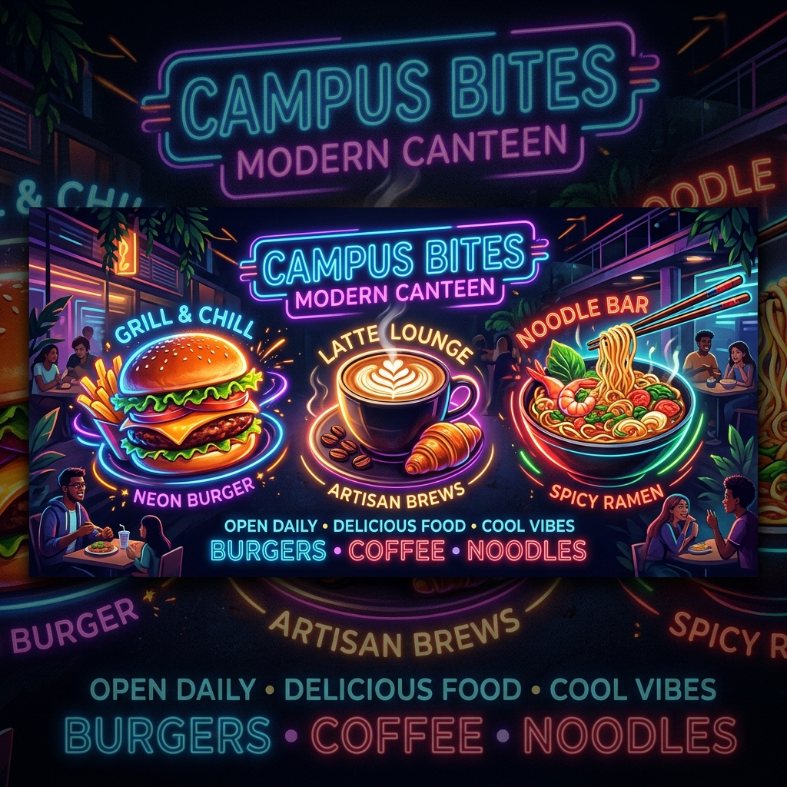

# BiteSpeed | Campus Smart Canteen 🍔⚡



BiteSpeed is a lightweight, fully responsive, client-side web application designed to modernize ordering and token generation at college or corporate canteens. Built for speed and efficiency, the application runs entirely in the browser and seamlessly synchronizes with a Google Sheet, which acts as a robust serverless backend and administration panel.

---

## ✨ Key Features

### 🎨 Premium Student Dashboard
- **Modern UI/UX:** A stunning, dark-themed glassmorphism interface built for both mobile and desktop screens.
- **Dynamic Digital Menu:** Real-time menu rendering grouped by logical categories (Meals, Snacks, Drinks, Desserts).
- **Smart Filtering & Search:** Includes a one-tap vegetarian-only toggle and a live search bar for quick ordering.

### 🛒 Seamless Ordering & Checkout
- **Intuitive Cart System:** Easily add items, adjust quantities with familiar `[ - ] 1 [ + ]` selectors, and instantly calculate totals.
- **Token Generation Engine:** Collects the student's Name and Roll Number at checkout to generate a secure, randomized digital token receipt.
- **My Tokens Ledger:** Students can retrieve their past token receipts anytime using their unique Roll Number.

### ⚙️ Serverless Architecture (Google Sheets Backend)
- **Zero-Maintenance Database:** All order data is instantly saved to a linked Google Sheet via Google Apps Script. 
- **Live Menu Management:** The Google Sheet acts as the admin panel. Updates to prices, new items, or toggling `inStock` to `FALSE` instantly reflect on the kiosk without requiring code deployments.

### 🔒 Built-in Security
- **XSS Protection:** Built-in sanitization for student inputs to prevent Cross-Site Scripting (XSS) vulnerabilities.
- **Defensive Data Handling:** Graceful fallbacks for corrupted or manipulated local storage data (e.g., token ID generation safeguards).
- **Secured Backend Endpoints:** Google Apps Script is strictly configured to only accept order submissions, preventing malicious menu modifications from the client side.

---

## 🏗️ Architecture & Data Flow

This project completely decouples the frontend client from the backend manager, requiring zero traditional server hosting (like Node.js or Python).

1. **Frontend (Client):** Standard HTML, CSS, and vanilla JS. It relies on `localStorage` for offline cart persistence, session state, and order history caching.
2. **Backend (Admin):** A connected Google Sheet acts as the Database.
   - **`Menu` Tab:** Polled by the frontend on load. The canteen manager manages inventory directly from here.
   - **`Orders` Tab:** Acts as a live ledger, securely logging every order's Token ID, Student Name, Roll Number, Items ordered, and Total Bill via HTTP POST requests.
   - **`Order Items` Tab:** Automatically logs individual line items for granular sales analytics.

---

## 📂 Project Structure

```text
📁 bite_speed
├── 📄 index.html              # Core markup, modals, and cart drawer
├── 📄 styles.css              # Custom design system, CSS variables, animations, and media queries
├── 📄 app.js                  # Application logic, state management, and Google Sheets API integration
├── 📄 google-apps-script.js   # The serverless backend script (Runs on Google Apps Script)
└── 📁 assets                  # Contains branding assets (logo, hero banners)
```

---

## 🚀 Installation & Deployment Guide

### Phase 1: Setup the Database (Google Sheets)
1. Create a new Google Sheet.
2. Click **Extensions > Apps Script**.
3. Delete any default code in `Code.gs` and paste the contents of `google-apps-script.js` into it.
4. Click **Deploy > New Deployment**.
5. Select **Type: Web app**.
   - **Description:** Canteen System Backend
   - **Execute as:** `Me` (Your Google Account)
   - **Who has access:** `Anyone` *(Crucial: This allows the student frontend to submit orders without Google login).*
6. Click **Deploy**, authorize the required permissions, and copy the **Web app URL**.

### Phase 2: Connect the Frontend
1. Open the `app.js` file in your preferred code editor.
2. Locate the `GOOGLE_SCRIPT_URL` variable at the top of the file (around line 11).
3. Paste your generated Web app URL into the quotes:
   ```javascript
   const GOOGLE_SCRIPT_URL = "https://script.google.com/macros/s/YOUR_UNIQUE_URL_HERE/exec";
   ```
4. Save the file.

### Phase 3: Launch
- You can serve the folder using any basic static file server (like Vercel, Netlify, or GitHub Pages), or simply open `index.html` in your browser.
- **First Run Initialization:** Upon its first connection to your Google Sheet, the script will automatically build the `Menu`, `Orders`, and `Order Items` tabs, and seed the menu with default items to get you started immediately!

---

## 🛠️ Managing the Canteen (Admin Workflow)

To add, edit, or remove menu items, simply open your Google Sheet and edit the `Menu` tab. 
- **Stock Management:** Change `inStock` to `TRUE` for items you want to display, and `FALSE` to instantly hide sold-out items.
- **Dietary Tags:** Ensure `isVeg` is correctly set to `TRUE` or `FALSE` so the student-facing Veg-Only filter works accurately.
- **Instant Updates:** Changes made in the Google Sheet will reflect in the app upon the next page reload. No redeployment necessary.

---

*Engineered for fast, resilient, and hassle-free campus dining.*
